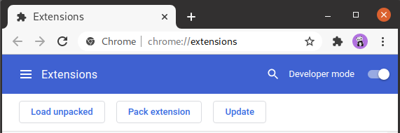
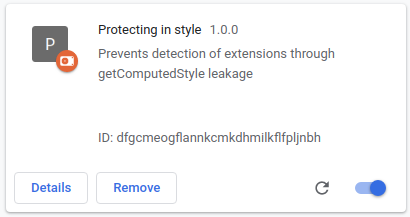

# Artifact for "Fingerprinting in Style: Detecting Browser Extensions via Injected Style Sheets"
Paper by Pierre Laperdrix, Oleksii Starov, Quan Chen, Alexandros Kapravelos and Nick Nikiforakis to appear at USENIX Security '21

Paper: [https://www.usenix.org/system/files/sec21-laperdrix.pdf](https://www.usenix.org/system/files/sec21-laperdrix.pdf)

### Extension
The **extension** folder contains our defense prototype that protects users against CSS-based extension fingerprinting.
It redirects _getComputedStyle_ calls made on 222,642 specific elements into a special Shadow DOM copy that will return benign measurements. 

### Demo page
[https://plaperdr.github.io/fingerprinting-in-style/demo/demo.html](https://plaperdr.github.io/fingerprinting-in-style/demo/demo.html)

In order to demonstrate the effectiveness of our extension, we have a demo page that detects 11 browser extensions through the style they inject on any page.
The 11 triggers we use were working as of January 4th 2021 but the targeted extensions may have been updated since then and so the detection may be altered. 

List of tested extensions (last tested versions in parentheses):
* [Data Scraper - Easy Web Scraping](https://chrome.google.com/webstore/detail/data-scraper-easy-web-scr/nndknepjnldbdbepjfgmncbggmopgden)
(v.3.299.84)
* [TTSReaderX In-Page Text to Speech](https://chrome.google.com/webstore/detail/ttsreaderx-in-page-text-t/pakknklefcjdhejnffafpeelofiekebg)
(v.1.32.5)
* [Touch VPN](https://chrome.google.com/webstore/detail/touch-vpn-secure-and-unli/bihmplhobchoageeokmgbdihknkjbknd)
(v.4.1.0)
* [AdBlocker by Trustnav](https://chrome.google.com/webstore/detail/adblocker-by-trustnav/dgbldpiollgaehnlegmfhioconikkjjh)
(v.2.8.1)
* [MozBar](https://chrome.google.com/webstore/detail/mozbar/eakacpaijcpapndcfffdgphdiccmpknp)
(v.3.1.252)
* [Disconnect](https://chrome.google.com/webstore/detail/disconnect/jeoacafpbcihiomhlakheieifhpjdfeo)
(v.20.3.1.1)
* [TripAdvisor Browser Button](https://chrome.google.com/webstore/detail/tripadvisor-browser-butto/oiekdmlabennjdpgimlcpmphdjphlcha)
(v.1.1.2.4)
* [Awesome Screenshot: Screen Video Recorder](https://chrome.google.com/webstore/detail/awesome-screenshot-screen/nlipoenfbbikpbjkfpfillcgkoblgpmj)
(v.4.3.12)
* [Hunter: Find email addresses in seconds](https://chrome.google.com/webstore/detail/hunter-find-email-address/hgmhmanijnjhaffoampdlllchpolkdnj)
(v.1.18.5)
* [Screenshot reader](https://chrome.google.com/webstore/detail/screenshot-reader/enfolipbjmnmleonhhebhalojdpcpdoo)
(v.1.0.8.2)
* [Cently (Coupons at Checkout)](https://chrome.google.com/webstore/detail/cently-coupons-at-checkou/kegphgaihkjoophpabchkmpaknehfamb)
(v.5.9.0)

### Instructions to test the extension
1. Download the extension by pulling the repo or downloading the corresponding zip file [HERE](https://github.com/plaperdr/fingerprinting-in-style/releases/download/1.0/fingerprinting-in-style-extension.zip).
2. On a Chromium-based browser like Chrome, visit the address "chrome://extensions/".
3. Activate "Developer mode" on the right and click on "Load unpacked extension".

4. Select the folder which contains the extension (the one from the repo or the unzipped file). 
You should see the "Protecting in style" extension enabled in your browser (see below).

5. Visit the [demo page](https://plaperdr.github.io/fingerprinting-in-style/demo/demo.html) and all fingerprinted extensions should be marked as "non" detected when the defense is active. 
Links to install the fingerprinted extensions can be found on the demo page.

### Dataset
To encourage further research on style fingerprinting, we make our dataset available so that future researchers can compare with our findings.
It contains the following two entities:
* The **trigger_pages** folder has the raw trigger pages that we used to check if an extension is detectable or not. 
Each HTML file contains thousands of very specific HTML structures with both a baseline version and a trigger one. 
When a detectable extension is present, it will manifest its presence by modifying the style of its corresponding "trigger" version. 
When compared with the style of the "baseline" one, we can compute the style fingerprint of the extension used for detection.
It should be noted that each HTML page outputs in the console the different style fingerprints it detects during its run.
The **trigger_map.txt** file contains the mapping between extension IDs and trigger number.
* The **4446_fingerprintable_extensions.zip** file is the full dataset of the 4,446 extensions that we found to be detectable through style fingerprinting and can be downloaded [HERE](https://kapravelos.com/datasets/fingerprintable_extensions/).
Each file in the zip follows the naming convention _"\<Extension ID\>\_\<version\>.zip"_. It is available outside of GitHub as its size is about 3.7GB. 
